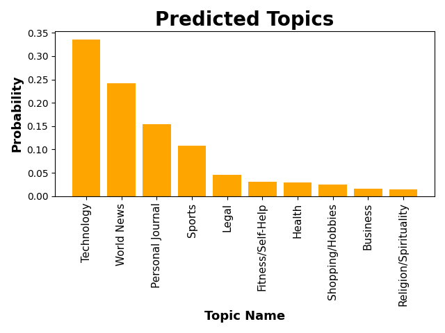

# Podcast Topic Guesser

### Project Description:
This is a topic guesser for a podcast channel. Given a description for a podcast, it predicts what topic the podcast is. This is targetted to podcast-makers who are planning to start a new channel and wants to understand which genre their podcast will be classified by Spotify, Apple Podcast, etc. The goal is to assist podcast-makers in understanding who their competitors are and expand their channel. 

The prediciton is made by using a LDA model trained by 13,000+ podcast descriptions from April 2018. Source: https://www.kaggle.com/datasets/roman6335/13000-itunes-podcasts-april-2018

### Files:
- poddf.csv: dataset used to train the model
- LdaBuilder.py: contains the codes for building and training the model
- main.py: contains the codes for using the trained model to make predictions
- requirement.txt: contains the packages required for this project
- sample_txt: folder containing text files that can be used to test the model
- lda_model: contains the trained model
- lda_dictionary: contains the dictionary used for building the model

### Running Instructions:
To make topic predictions using the LDA model, run main.py in your terminal. You can use txt files in the sample_txt folder to test with different podcast descriptions, or create your own query in query.txt. The top 5 predicted topics will be printed in your terminal after running.

To build and train an LDA model, run LdaBuilder.py. 
Procedure for building and using a LDA model:
1. Load dataset
2. Clean texts
3. Create dictionary and corpus (term docuemnt frequency) from the cleaned texts
4. Build and train LDA model using the dictionary and corpus.
5. Compute coherence score to evaluate the model.
6. Save model to use for prediction in main.py
